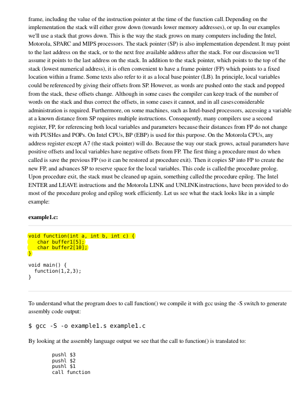

# pypdfht

## Overview
`pypdfht` is a simple python app to highlight text within PDF files. It provides a simple API for identifying and highlighting specific strings of text on any given page of a PDF.

## Features
- **Text Highlighting**: Utilize the `highlight_entire_text_on_page` function to programmatically highlight text on a PDF page.

## API Example
```python
    data = {
        'page_number': 3,
        'text': 'void function(int a, int b, int c) { char buffer1[5]; char buffer2[10]; }'
    }
    
    # Files to be uploaded (if any)
    files = {
        'file': open('example.pdf', 'rb')  # Replace 'example.pdf' with the actual file path
    }    
    # Make a POST request to the Flask route
    response = requests.post('http://localhost:5000/highlight', data=data, files=files)
    # Decode the JSON response
    response_data = response.json()
    
    if 'error' in response_data:
        print(response_data)
        return

    with open('highlighted_image.png', 'wb') as f:
        # Decode the base64 string to bytes directly
        decoded_image_data = base64.b64decode(response_data['image_data_base64'])
        f.write(decoded_image_data)
```

## Usage
To use the highlighting feature, ensure you have a running instance of the server that includes the `highlight` route as defined in `app.py`. Then, use the curl command above to send a request to the server.

## Installation
Clone the repository and install the required Python packages:
```bash
git clone https://github.com/nagendra-y/pypdfht.git
cd pypdfht
pip install -r requirements.txt
```

## Running the Server
To start the server, run:
```bash
python app.py
```

This will start a Flask server that listens for requests to highlight text in PDF files.

